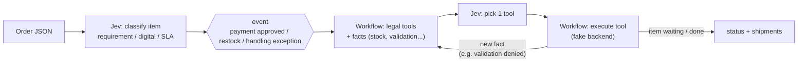
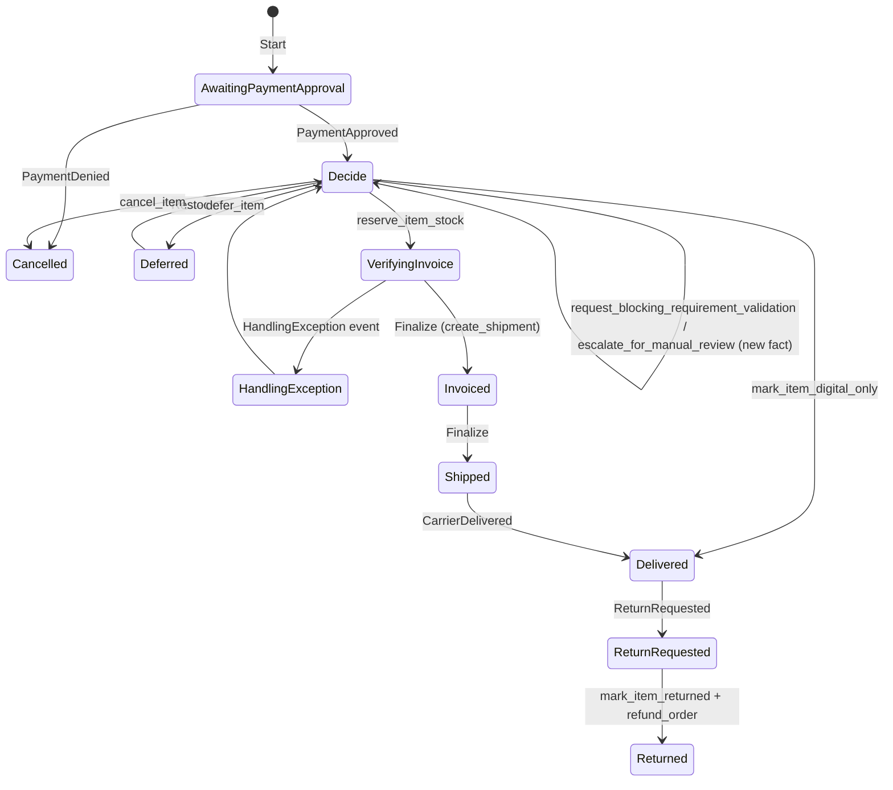

# jev-wf

Order workflow prototype where **Jev** (`typesafe/jev-1.13`, via OpenRouter's Decisions API) **classifies items and picks which tool to run** at each item-level decision point. The C# workflow decides which tools are legal and executes them.

## Who does what



## Actions (tools)

**Chosen by the Jev** — each one is a JSON file in [`tools/`](tools/). Adding a tool = adding a file, no C#:

```json
{
  "name": "fraud_check",
  "description": "Sends a high-value item to the anti-fraud provider.",
  "whenToUse": "item_value is above 5000 and fraud_check is 'not requested'.",
  "offeredAt": ["payment_approved"],
  "requires": { "fraud_check": ["not requested"] },
  "action": "external",
  "produces": { "fact": "fraud_check", "values": ["approved", "rejected"] }
}
```

| Field | Meaning | Used by |
|---|---|---|
| `whenToUse` | free text, **written as a condition over the facts** | the Jev (it's the Choice option) |
| `offeredAt` | decision points: `payment_approved`, `restock`, `handling_exception` | engine |
| `requires` | hard guardrail: fact → allowed values; if it fails the Jev never sees the tool | engine |
| `action` | `external` (runs outside, result becomes a fact) or built-in: `complete_digital`, `reserve_stock`, `defer`, `cancel` | engine |
| `produces` | fact an `external` tool writes; first value = passing, others = failed check | engine |

Engine loop per decision:

1. Build facts → filter tools by `offeredAt` + `requires`.
2. **Checks** (`external`): the Jev evaluates each `whenToUse` **on its own** (one yes/no `Noul` per tool, one API call). Every check that applies runs; its result becomes a fact → back to 1.
3. **Actions** (built-ins): the Jev picks **one** by `whenToUse` (`Choice`) → run it.

Why split: in a single `Choice`, `fraud_check` (specific) lost to `reserve_item_stock` (generic) because both conditions were true — the gold watch shipped without a fraud check. Checks never compete with actions now.

| Tool | Offered at | Jev picks it when… |
|---|---|---|
| `mark_item_digital_only` | payment approved | digital = yes → nothing to ship |
| `request_blocking_requirement_validation` | payment approved | requirement ≠ none and not yet validated |
| `escalate_for_manual_review` | payment approved | classification confidence < 0.75 and not yet reviewed |
| `reserve_item_stock` | payment approved, restock, handling exception | physical, stock available, `failed_checks` = none |
| `defer_item` | payment approved, restock, handling exception | physical and no origin has stock |
| `cancel_item` | payment approved, restock, handling exception | `failed_checks` ≠ none |
| `fraud_check` ⭐ | payment approved | item value > 5000 and not yet checked — **custom, JSON only** |

**Facts vocabulary** (what `whenToUse`/`requires` can reference): `trigger`, `current_status`, `classified_blocking_requirement`, `classified_digital_only`, `classified_shipping_sla`, `classification_confidence`, `item_value`, `stock`, `failed_origins`, `last_attempt`, every `produces.fact` (starts `not requested`), and `failed_checks` (derived).

**Called by the workflow** — no real alternative, so no Jev:

| Tool | When |
|---|---|
| `request_seller_confirmation`, `await_payment_approval` | Start |
| `cancel_item` | PaymentDenied event |
| `set_shipping_method`, `start_fulfillment` | inside `reserve_item_stock` (SLA from classification, origin from sourcing math) |
| `complete_item` | inside `mark_item_digital_only` |
| `handle_handling_exception` | HandlingException event |
| `create_shipment`, `mark_item_shipped`, `notify_customer`, `close_order` | Finalize (groups by origin + SLA) |
| `mark_item_delivered` | CarrierDelivered event |
| `request_return`, `mark_item_returned`, `refund_order` | ReturnRequested event |

In the catalog but not implemented yet: `get_order`, `hold_order`.

- **Facts the Jev sees:** product description, classification, confidence, stock at best origin, validation/review results, last rejected attempt.
- **Guardrails (`requires`, not Jev):** `reserve_item_stock` only after a legal requirement is validated and with no failed check; a reserve with no stock is rejected and fed back as a fact; max 6 decisions per event.
- **Deterministic (no real choice):** seller confirmation, payment gate/denial, shipment grouping by **(origin, SLA)**, delivery, return + refund.
- **Tools are fake** (`FakeOrderBackend`): change status + write a log line. Jev choices appear in the log as `[jev] item: options=[...] -> tool (confidence)`.

## Result: the Jev picks the right tool

**11/11 scenarios passed** with tools loaded from JSON, including `fraud_check`, a tool that exists **only as a JSON file** (real Decisions API, 2026-09-25). Checks answered at 0.02–0.07 (no) / 0.97–0.98 (yes); actions at 0.93–1.00.

How we got there — each row is a real run:

| Engine version | Result | What happened |
|---|---|---|
| Tool options written as **actions** ("put the item on hold…") | **1/10** | Jev picked `defer_item` almost always, confidence 0.3–0.6 |
| Options written as **conditions over facts** ("physical and no origin has stock") | **10/10** | confidence 0.98–1.00 |
| + `fraud_check` added as JSON, all tools in **one `Choice`** | **10/11** | old 10 unaffected, but the gold watch shipped: `reserve_item_stock` (generic, also true) beat `fraud_check` (specific) |
| **Checks as independent yes/no**, then one `Choice` for the action | **11/11** | `fraud_check=yes (0.98)` → rejected → `cancel_item`; socks `fraud_check=no (0.02)` → shipped |

Two rules for tool authors:
1. Write `whenToUse` as a **condition** (*when* it applies), never as what the tool does.
2. Checks don't compete with actions: an `external` tool is evaluated on its own, so a new check can't be shadowed by an existing action.

Real decisions from the run:

```
# custom JSON-only tool: high-value item → fraud check → rejected → cancel
[jev] goldwatch1: checks escalate_for_manual_review=no (0.04), fraud_check=yes (0.98)
fraud_check(goldwatch1) -> rejected
[jev] goldwatch1: options=[cancel_item, defer_item] -> cancel_item (confidence 1.00)
[jev] socks1: checks escalate_for_manual_review=no (0.03), fraud_check=no (0.02)
[jev] socks1: options=[cancel_item, defer_item, mark_item_digital_only, reserve_item_stock] -> reserve_item_stock (confidence 1.00)

# prescription denied → validate, then cancel
[jev] deniedmed1: checks escalate_for_manual_review=no (0.04), fraud_check=no (0.07), request_blocking_requirement_validation=yes (0.97)
request_blocking_requirement_validation(deniedmed1) -> denied
[jev] deniedmed1: options=[cancel_item, defer_item] -> cancel_item (confidence 1.00)

# damaged in packing → Jev re-reserves, workflow excludes the failed origin
[jev] vase1: options=[cancel_item, defer_item, reserve_item_stock] -> reserve_item_stock (confidence 1.00)
reserve_item_stock(vase1, origin=fragile-origin-b-rj, qty=1)

# no stock → defer; restock arrives → reserve
[jev] toy2: options=[...] -> defer_item (confidence 1.00)
[jev] toy2: options=[cancel_item, defer_item, reserve_item_stock] -> reserve_item_stock (confidence 0.93)
```

## Item lifecycle



`Decide` is not a stored status: the item keeps its status while the Jev picks tools. Order status is derived from item statuses (`OrderStatusAggregator`).

Passed through instantly by the fake: `AwaitingSellerConfirmation` (in Start), `AwaitingCancellationWindow` → `ReadyForHandling` → `Handling` (in `reserve_item_stock`). Declared in `ItemStatus` but never used yet: `Reserved`, `AwaitingBlockingRequirementValidation`, `AwaitingManualReview`, `Refunded`, `CancellationRequested`, `Cancelling`.

## Structure

| Project | Role |
|---|---|
| `JevWf.Decisions` | HTTP client for the Decisions API |
| `JevWf.Classification` | The only place that calls the Jev: `OrderItemClassifier` + `JevToolSelector` |
| `JevWf.Orders` | Workflow, sourcing, tools, fake backend |
| `JevWf.Evaluation` | Scenario tests (below) |

## Running

```powershell
$env:OPENROUTER_API_KEY = "sk-or-v1-..."
dotnet run --project src/JevWf.Orders        # sample order
dotnet run --project src/JevWf.Evaluation    # all scenarios
```

## Scenario tests

Real Jev (classification + tool choices) + workflow, then asserts final status per item and shipments. A wrong tool choice shows up as a wrong outcome.

Each folder has `input.json` (order + stock per origin + events), `output.json` (classification, final status, shipments, tool calls) and a README explaining both.

| Scenario | Covers |
|---|---|
| [simple-shirt](scenarios/simple-shirt/) | Baseline: one item, one seller |
| [multi-seller-complex](scenarios/multi-seller-complex/) | Different sellers/origins/SLAs; one item out of stock |
| [mixed-attributes](scenarios/mixed-attributes/) | Prescription + digital + cold-chain + queue-effect sourcing |
| [same-origin-merges-across-sellers](scenarios/same-origin-merges-across-sellers/) | Same origin + SLA → one shipment, seller doesn't matter |
| [prescription-denied](scenarios/prescription-denied/) | Requirement denied → cancelled |
| [heterogeneous-network](scenarios/heterogeneous-network/) | 5 origin types, 3 SLAs |
| [payment-denied](scenarios/payment-denied/) | Payment denied → cancelled |
| [restock-reopens-deferred-item](scenarios/restock-reopens-deferred-item/) | Restock recovers deferred item |
| [handling-exception-reroutes-to-resourcing](scenarios/handling-exception-reroutes-to-resourcing/) | Damage → re-sourced from another origin |
| [return-after-delivery](scenarios/return-after-delivery/) | Return + refund |
| [custom-tool-fraud-check](scenarios/custom-tool-fraud-check/) ⭐ | Tool defined only in JSON: high-value item checked → rejected → cancelled; cheap item skips the check |

See [Result](#result-the-jev-picks-the-right-tool). Regenerate scenario READMEs without API: `dotnet run --project src/JevWf.Evaluation -- --readme-only`.

## Not done yet

Real backend/inventory, real event source (webhooks), manual-review test, partial quantities, confidence-threshold tuning.
