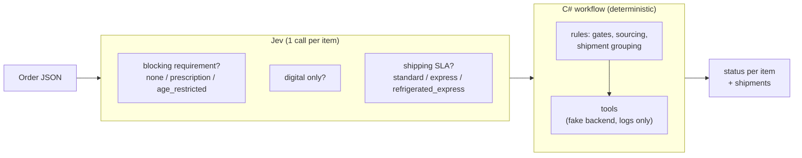
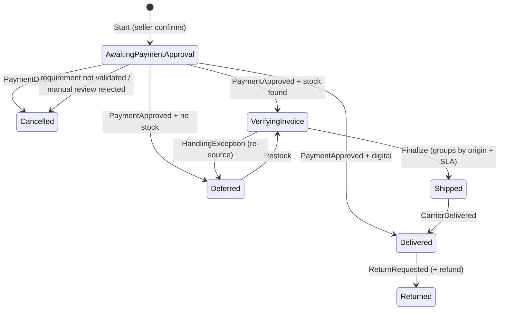

# jev-wf

Order workflow prototype that uses **Jev** (`typesafe/jev-1.13`, via OpenRouter's Decisions API) **only to classify items**. Everything else is plain C#.

## Who does what



- **The Jev never sees or calls tools.** It answers 3 questions per item from the free-text description. That's it.
- **The C# workflow** (`OrderWorkflowRunner`) reads those answers and decides which tool to call (`reserve_item_stock`, `create_shipment`, `cancel_item`, ...).
- **Tools are fake** (`FakeOrderBackend`): they change the item status and write a log line. No real OMS/inventory behind them.

## Item lifecycle (what the C# workflow does)



- Payment is approved **per seller** (marketplace).
- Low Jev confidence (< 0.75) → `escalate_for_manual_review`.
- Sourcing = lowest effective lead time with stock. Pure math, no Jev.
- Shipments group by **(origin, SLA)**, never by seller.
- Order status is never stored — derived from item statuses (`OrderStatusAggregator`).
- Intermediate states (`Reserved`, `Handling`, cancellation window, ...) exist in `ItemStatus` but the fake passes through them instantly.

## Structure

| Project | Role |
|---|---|
| `JevWf.Decisions` | HTTP client for the Decisions API |
| `JevWf.Classification` | The only place that calls the Jev (3 questions per item) |
| `JevWf.Orders` | Workflow, sourcing, tools, fake backend |
| `JevWf.Evaluation` | Scenario tests (below) |

## Running

```powershell
$env:OPENROUTER_API_KEY = "sk-or-v1-..."
dotnet run --project src/JevWf.Orders        # sample order
dotnet run --project src/JevWf.Evaluation    # all scenarios
```

## Scenario tests

Tests the **solution**, not the Jev: real Jev call + workflow, then asserts final status per item and shipments.

Each folder has `input.json` (order + stock per origin + events), `output.json` (classification, final status, shipments, tool calls) and a README explaining both.

| Scenario | Covers |
|---|---|
| [simple-shirt](scenarios/simple-shirt/) | Baseline: one item, one seller |
| [multi-seller-complex](scenarios/multi-seller-complex/) | Different sellers/origins/SLAs; one item out of stock |
| [mixed-attributes](scenarios/mixed-attributes/) | Prescription + digital + cold-chain + queue-effect sourcing |
| [same-origin-merges-across-sellers](scenarios/same-origin-merges-across-sellers/) | Same origin + SLA → one shipment, seller doesn't matter |
| [prescription-denied](scenarios/prescription-denied/) | Requirement denied → cancelled |
| [heterogeneous-network](scenarios/heterogeneous-network/) | 5 origin types, 3 SLAs |
| [payment-denied](scenarios/payment-denied/) | Payment denied → cancelled |
| [restock-reopens-deferred-item](scenarios/restock-reopens-deferred-item/) | Restock recovers deferred item |
| [handling-exception-reroutes-to-resourcing](scenarios/handling-exception-reroutes-to-resourcing/) | Damage → re-sourced from another origin |
| [return-after-delivery](scenarios/return-after-delivery/) | Return + refund |

Latest run: **10/10 passed** (2026-09-24). Regenerate scenario READMEs without API: `dotnet run --project src/JevWf.Evaluation -- --readme-only`.

## Not done yet

Real backend/inventory, real event source (webhooks), manual-review test, partial quantities, confidence-threshold tuning.
