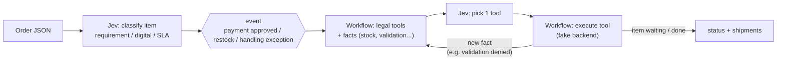
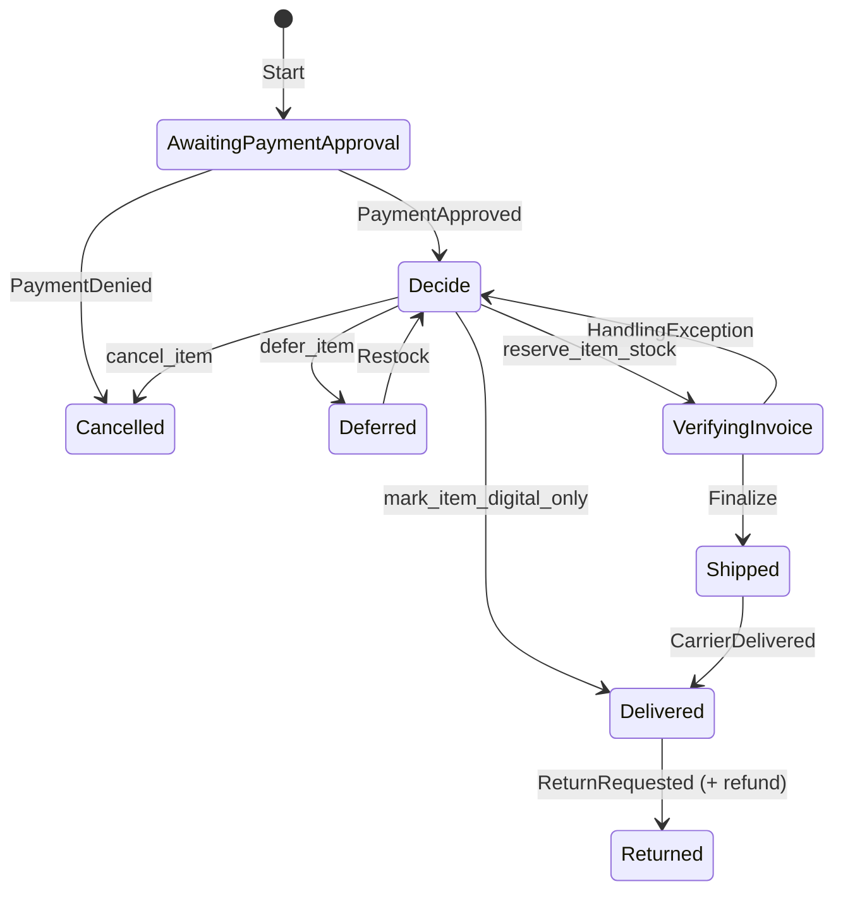

# jev-wf

Order workflow prototype where **Jev** (`typesafe/jev-1.13`, via OpenRouter's Decisions API) **classifies items and picks which tool to run** at each item-level decision point. The C# workflow decides which tools are legal and executes them.

## Who does what



| Decision point | Tools offered to the Jev |
|---|---|
| Payment approved | `mark_item_digital_only`, `request_blocking_requirement_validation`, `escalate_for_manual_review`, `reserve_item_stock`, `defer_item`, `cancel_item` |
| Restock | `reserve_item_stock`, `defer_item`, `cancel_item` |
| Handling exception | `reserve_item_stock` (failed origin excluded), `defer_item`, `cancel_item` |

- **Facts the Jev sees:** product description, classification, confidence, stock at best origin, validation/review results, last rejected attempt.
- **Guardrails (code, not Jev):** `reserve_item_stock` is only offered after a legal requirement is validated; a reserve with no stock is rejected and fed back as a fact; max 5 decisions per event.
- **Deterministic (no real choice):** seller confirmation, payment gate/denial, shipment grouping by **(origin, SLA)**, delivery, return + refund.
- **Tools are fake** (`FakeOrderBackend`): change status + write a log line. Jev choices appear in the log as `[jev] item: options=[...] -> tool (confidence)`.

## Result: the Jev picks the right tool

**10/10 scenarios passed**, tool choices at confidence **0.98–1.00** (real Decisions API, 2026-09-24).

The key was **how tool options are written**:

| Tool option wording | Example (`defer_item`) | Result |
|---|---|---|
| ❌ As an action | "Put the item on hold until something changes (e.g. restock)." | **1/10** — Jev picked `defer_item` almost always, confidence 0.3–0.6 |
| ✅ As a condition over the facts | "The product is physical and stock says 'no origin has stock'." | **10/10** — confidence 0.98–1.00 |

The Jev is a classifier: it matches facts against conditions, so options must describe *when* they apply, not *what they do*.

Real decisions from the run:

```
# prescription denied → Jev validates, then cancels
[jev] deniedmed1: options=[..., request_blocking_requirement_validation, ...] -> request_blocking_requirement_validation (confidence 1.00)
request_blocking_requirement_validation(deniedmed1, type=prescription) -> denied
[jev] deniedmed1: options=[mark_item_digital_only, escalate_for_manual_review, defer_item, cancel_item] -> cancel_item (confidence 1.00)

# damaged in packing → Jev re-reserves, workflow excludes the failed origin
[jev] vase1: options=[reserve_item_stock, defer_item, cancel_item] -> reserve_item_stock (confidence 0.98)
reserve_item_stock(vase1, origin=fragile-origin-b-rj, qty=1)

# no stock → defer; restock arrives → reserve
[jev] toy2: options=[...] -> defer_item (confidence 1.00)
[jev] toy2: options=[reserve_item_stock, defer_item, cancel_item] -> reserve_item_stock (confidence 0.87)
```

## Item lifecycle



`Decide` = Jev picks a tool (loop above). Order status is derived from item statuses (`OrderStatusAggregator`). Intermediate states (`Reserved`, `Handling`, ...) exist in `ItemStatus` but the fake passes through them instantly.

## Structure

| Project | Role |
|---|---|
| `JevWf.Decisions` | HTTP client for the Decisions API |
| `JevWf.Classification` | The only place that calls the Jev: `OrderItemClassifier` + `JevToolSelector` |
| `JevWf.Orders` | Workflow, sourcing, tools, fake backend |
| `JevWf.Evaluation` | Scenario tests (below) |

## Running

```powershell
$env:OPENROUTER_API_KEY = "sk-or-v1-..."
dotnet run --project src/JevWf.Orders        # sample order
dotnet run --project src/JevWf.Evaluation    # all scenarios
```

## Scenario tests

Real Jev (classification + tool choices) + workflow, then asserts final status per item and shipments. A wrong tool choice shows up as a wrong outcome.

Each folder has `input.json` (order + stock per origin + events), `output.json` (classification, final status, shipments, tool calls) and a README explaining both.

| Scenario | Covers |
|---|---|
| [simple-shirt](scenarios/simple-shirt/) | Baseline: one item, one seller |
| [multi-seller-complex](scenarios/multi-seller-complex/) | Different sellers/origins/SLAs; one item out of stock |
| [mixed-attributes](scenarios/mixed-attributes/) | Prescription + digital + cold-chain + queue-effect sourcing |
| [same-origin-merges-across-sellers](scenarios/same-origin-merges-across-sellers/) | Same origin + SLA → one shipment, seller doesn't matter |
| [prescription-denied](scenarios/prescription-denied/) | Requirement denied → cancelled |
| [heterogeneous-network](scenarios/heterogeneous-network/) | 5 origin types, 3 SLAs |
| [payment-denied](scenarios/payment-denied/) | Payment denied → cancelled |
| [restock-reopens-deferred-item](scenarios/restock-reopens-deferred-item/) | Restock recovers deferred item |
| [handling-exception-reroutes-to-resourcing](scenarios/handling-exception-reroutes-to-resourcing/) | Damage → re-sourced from another origin |
| [return-after-delivery](scenarios/return-after-delivery/) | Return + refund |

See [Result](#result-the-jev-picks-the-right-tool). Regenerate scenario READMEs without API: `dotnet run --project src/JevWf.Evaluation -- --readme-only`.

## Not done yet

Real backend/inventory, real event source (webhooks), manual-review test, partial quantities, confidence-threshold tuning.
