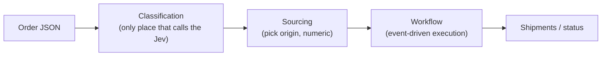
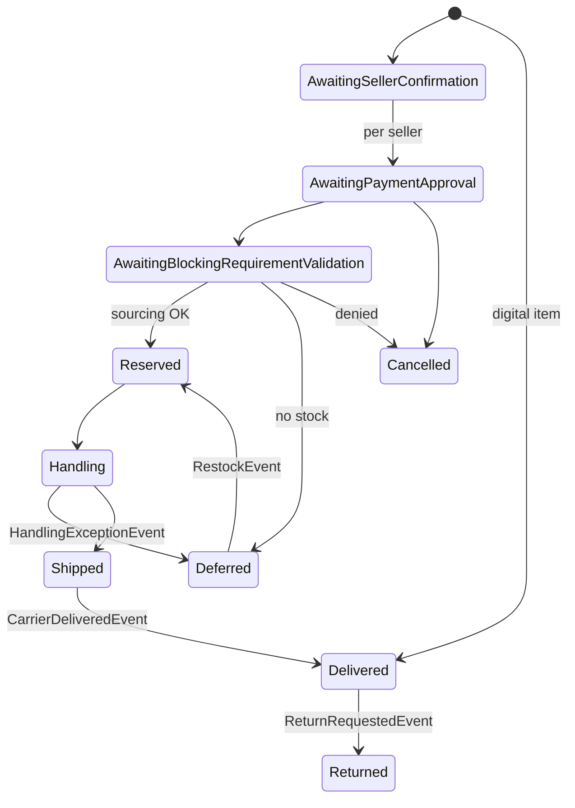

# jev-wf

Generic order-movement workflow built on **Jev** (TypeSafe's "System One" model, via OpenRouter's Decisions API).

The Jev only answers atomic `Noul`/`Choice` questions about an item's free-text description (with confidence). It never decides the next action and never generates free text — everything after classification is deterministic code.

## Pipeline



- **Classification** (`JevWf.Classification`) — resolves per item: blocking requirement type (`none`/`prescription`/`age_restricted`/...), digital flag, shipping SLA, confidence.
- **Sourcing** (`JevWf.Orders/Sourcing`) — picks the lowest *effective* (demand-adjusted) lead-time origin with stock. Pure math, no model call.
- **Workflow** (`JevWf.Orders/Workflow`) — deterministic, event-driven (below). Shipments group by `(origin, SLA)`, never by seller — same order, same seller, different origin/SLA ⇒ separate shipments.

## Item lifecycle



`OrderWorkflowRunner` exposes `Start` (up to payment gate), `HandleEvent` (reacts to one `OrderEvent`), `Finalize` (groups shipments, closes order — idempotent). Order status is never stored; `OrderStatusAggregator` derives it from item statuses.

## Structure

| Project | Role |
|---|---|
| `JevWf.Decisions` | Generic Decisions API client. Domain-agnostic. |
| `JevWf.Classification` | Only project that calls the Jev. |
| `JevWf.Orders` | Models, Sourcing, Workflow, Tools — all deterministic. |
| `JevWf.Evaluation` | Scenario tests for the solution (below). |

## Running

```powershell
$env:OPENROUTER_API_KEY = "sk-or-v1-..."
dotnet run --project src/JevWf.Orders        # sample order, full lifecycle
dotnet run --project src/JevWf.Evaluation    # all scenario tests
```

## Scenario tests

Each scenario runs the **real** pipeline (real Jev call) and asserts the resulting outcome — this tests the solution, not the Jev.

| Scenario | Covers |
|---|---|
| `simple-shirt` | Trivial baseline, one item, one seller |
| `multi-seller-complex` | Different sellers/origins/SLAs never merge; out-of-stock item defers |
| `mixed-attributes` | Prescription + digital + cold-chain + queue-effect sourcing (regression) |
| `same-origin-merges-across-sellers` | Same origin+SLA merges shipments, seller doesn't matter |
| `prescription-denied` | Blocking requirement denied → cancelled before sourcing |
| `heterogeneous-network` | 5 origin types, all 3 SLAs at once |
| `payment-denied` | Payment never clears → cancelled at the gate |
| `restock-reopens-deferred-item` | `RestockEvent` recovers a deferred item |
| `handling-exception-reroutes-to-resourcing` | Damage event reroutes to a different origin |
| `return-after-delivery` | Post-delivery return + refund |

Not covered: `AwaitingManualReview` rejection (needs a genuinely low-confidence real Jev answer — can't force it deterministically without an ambiguous, flaky description).

**Latest run:** `10/10 scenarios passed` against the real Decisions API (2026-09-24).

## Status

Functional prototype, validated end-to-end. Missing: real confidence-threshold tuning, a real event source (restock/carrier webhooks are only fired by tests today), partial-quantity fulfillment, real backend/inventory integrations.
